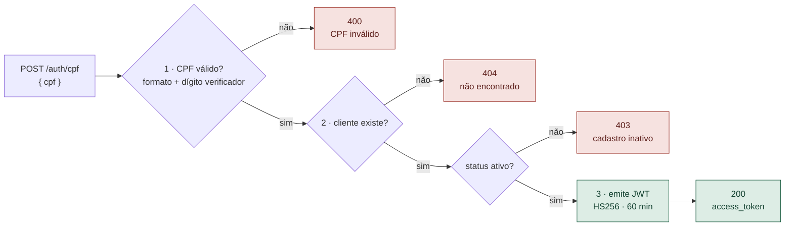
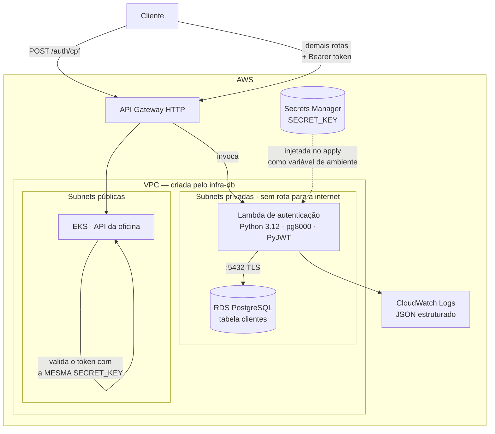

# tech-challenge-auth-lambda — Autenticação por CPF

Function serverless que autentica o cliente da oficina pelo **CPF/CNPJ** e emite o
**JWT** consumido pelas APIs protegidas.

> Pós-Tech Software Architecture · FIAP · Tech Challenge Fase 03

| | |
|---|---|
| **Runtime** | AWS Lambda · Python 3.12 · 512 MB |
| **Exposição** | `POST /auth/cpf` no API Gateway |
| **Rede** | Subnet privada da VPC, para alcançar o RDS |
| **Testes** | sem dependência de AWS ou banco |

---

## Os quatro repositórios

| Repositório | Responsabilidade |
|---|---|
| `tech-challenge-infra-db` | VPC, RDS, Secrets Manager — **aplicar primeiro** |
| `tech-challenge-infra-k8s` | EKS, ECR, API Gateway, OIDC — **aplicar em segundo** |
| **tech-challenge-auth-lambda** ← você está aqui | Autenticação por CPF e emissão do JWT |
| `tech-challenge-app` | API REST da oficina, valida o token emitido aqui |

---

## Documentação

| Documento | Onde está |
|---|---|
| Diagrama de componentes | `tech-challenge-infra-k8s` · README, seção *Arquitetura* |
| Sequência da autenticação por CPF | `tech-challenge-infra-k8s` · README, *Fluxo de uma requisição autenticada* |
| Sequência da abertura de ordem de serviço | `tech-challenge-app` · README, *Abertura de uma ordem de serviço* |
| Modelo de dados: ER, relacionamentos e ajustes | `tech-challenge-app` · `docs/modelo-de-dados.md` |
| RFC-001 · Escolha da nuvem | `tech-challenge-infra-k8s` · `docs/rfc/RFC-001-nuvem.md` |
| RFC-002 · Escolha do banco de dados | `tech-challenge-infra-db` · `docs/rfc/RFC-002-banco-de-dados.md` |
| RFC-003 · Estratégia de autenticação | `tech-challenge-auth-lambda` · `docs/rfc/RFC-003-autenticacao.md` |
| ADR-001 a 004 · rede e banco | `tech-challenge-infra-db` · README |
| ADR-005 a 008, 013 e 014 · cluster, CI e observabilidade | `tech-challenge-infra-k8s` · README |
| ADR-009 a 012 · autenticação | `tech-challenge-auth-lambda` · README |
| Swagger | `<url_api>/docs` na AWS · `http://localhost:8000/docs` localmente |
| Coleção Postman | `tech-challenge-app` · `postman/oficina.postman_collection.json` |
| Ambientes e deploy ativo | só produção, com a dispensa de homologação registrada no README do `tech-challenge-app`; o ambiente AWS é efêmero (ADR-013), e a URL da API sai em `make output`, no `tech-challenge-infra-k8s`, durante uma sessão |


---

## O que a função faz

Exatamente os três passos que o desafio descreve:



Repare que a validação do CPF acontece **antes** de qualquer consulta ao banco: um
documento malformado nem chega a abrir conexão. Há teste garantindo isso.

### Arquitetura



---

## Como usar

### Obter um token

```bash
curl -X POST "$ENDPOINT/auth/cpf" \
  -H 'content-type: application/json' \
  -d '{"cpf":"529.982.247-25"}'
```

```json
{
  "access_token": "eyJhbGciOiJIUzI1NiIs...",
  "token_type": "bearer",
  "expires_in": 3600,
  "cliente": { "id": "3fa85f64-...", "nome": "João Silva" }
}
```

O CPF pode vir com ou sem pontuação e vai sempre no corpo: em query string, ficaria gravado em
histórico de navegador e em log de proxy.

### Usar o token

```bash
curl "$ENDPOINT/atendimento/os/consulta" \
  -H "Authorization: Bearer $TOKEN"
```

### Respostas

| Situação | Status |
|---|---|
| Autenticado | `200` |
| CPF malformado ou dígito verificador errado | `400` |
| Cliente não cadastrado | `404` |
| Cadastro inativo | `403` |
| Banco inacessível | `503` |

---

## O token

```json
{
  "sub": "3fa85f64-5717-4562-b3fc-2c963f66afa6",
  "tipo": "cliente",
  "cpf_cnpj": "52998224725",
  "nome": "João Silva",
  "iat": 1757437200,
  "exp": 1757440800
}
```

O claim **`tipo`** é o que distingue este token do emitido pelo `/auth/token` da
própria API, usado por funcionários. A API decide o que cada um acessa a partir dele:
um cliente enxerga apenas as próprias ordens de serviço; um atendente opera a oficina.

> **A `SECRET_KEY` é compartilhada.** Esta função assina, a API valida. As duas leem do
> mesmo segredo no Secrets Manager, criado pelo `infra-db`. Se divergirem, todo token é
> rejeitado com erro genérico de credencial inválida — sintoma difícil de diagnosticar,
> e o primeiro lugar a olhar quando a integração falha.

---

## Decisões técnicas

A estratégia de autenticação, comparada com Cognito, authorizer no gateway e login dentro da
API, está na [RFC-003](docs/rfc/RFC-003-autenticacao.md).

### ADR-009 · pg8000 em vez de psycopg2

**Decisão.** O driver PostgreSQL é o **pg8000**, escrito em Python puro.

**Motivo.** É de empacotamento, não de desempenho. O `psycopg2` traz binários
compilados que precisam corresponder à arquitetura do runtime da Lambda — o que
obrigaria a montar o pacote dentro de um container Linux, ou a manter uma layer
própria. Com pg8000 o zip é montado com um `pip install -t` em qualquer máquina,
e o `make build` funciona igual no macOS e no runner do CI.

**Consequência.** Desempenho um pouco menor que o do driver em C. Irrelevante aqui:
a função faz **uma** consulta por invocação.

**Armadilha encontrada.** Os diretórios `.dist-info` precisam ir no pacote. O `scramp`,
dependência do pg8000 para autenticação SCRAM, lê a própria versão via
`importlib.metadata` e falha na importação sem eles. O `make build` os preserva de
propósito, e o CI valida importando o zip antes de publicar.

---

### ADR-010 · Segredo por variável de ambiente, não por consulta em execução

**Decisão.** O Terraform lê o segredo no `apply` e o injeta como variável de ambiente
da função, em vez de a função consultar o Secrets Manager a cada invocação.

**Motivo.** A Lambda roda em subnet privada e **não há NAT Gateway** (decisão de custo
documentada no `infra-db`). Sem rota para a internet, ela não alcançaria a API do
Secrets Manager — seria preciso um VPC Endpoint de interface, a ~US$ 7/mês.

**Contrapartida assumida.** O valor passa a constar no state do Terraform, que vive num
bucket S3 criptografado, versionado e com acesso público bloqueado. As variáveis de
ambiente da Lambda também são cifradas em repouso.

**Em produção de verdade:** VPC Endpoint e leitura em execução, com cache no container,
o que ainda permite rotação de segredo sem novo deploy.

---

### ADR-011 · Validação de CPF duplicada, e não compartilhada

**Decisão.** A regra de validação de CPF/CNPJ é reimplementada aqui, em vez de importada
de uma biblioteca comum com o `tech-challenge-app`.

**Motivo.** O desafio exige repositórios independentes. Uma biblioteca compartilhada
criaria acoplamento de build: publicar em registry privado, versionar, e um deploy da
API passaria a depender de release de pacote.

**Por que o custo é baixo.** A regra é estável — dígito verificador de CPF não muda desde
1968 — e está coberta por testes dos dois lados. Se um dia divergirem, os testes acusam.

---

### ADR-012 · A rota pertence a quem é dono da função

**Decisão.** O `infra-k8s` cria o API Gateway e a rota coringa para o cluster. A rota
`/auth/cpf` é criada **por este repositório**.

**Motivo.** Quem conhece o contrato da função é quem a implementa. Se as rotas
morassem todas no `infra-k8s`, mudar o caminho da autenticação exigiria alterar um
repositório de infraestrutura — acoplamento desnecessário entre times.

**Como funciona.** Este repositório lê `/tech-challenge/apigateway/id` no SSM e registra
a integração. No API Gateway HTTP, **rota explícita vence a coringa**: `POST /auth/cpf`
chega à Lambda, todo o resto segue para o EKS.

---

## Desenvolvimento

```bash
make venv     # ambiente virtual e dependências
make test     # sem AWS e sem banco
make cov      # com cobertura
make build    # monta dist/lambda.zip
```

Os testes substituem o banco por um dublê em memória, então a suíte roda em qualquer
lugar em menos de um segundo.

### Estrutura

```
src/
├── handler.py       entrada da Lambda · orquestra os três passos
├── cpf.py           validação de CPF/CNPJ e máscara para log
├── repositorio.py   consulta ao PostgreSQL via pg8000
└── emissor.py       emissão do JWT

infra/               Terraform: função, IAM e rota no gateway
tests/               sem AWS nem banco
```

> O arquivo de emissão se chama `emissor.py`, e não `token.py`, para não colidir com o
> módulo `token` da biblioteca padrão do Python.

---

## Deploy

> **Montando tudo do zero?** O roteiro completo, com a ordem dos quatro repositórios, está no
> README do `tech-challenge-infra-db`, seção *Do zero numa conta nova*.

### Pré-requisitos

`infra-db` aplicado e `infra-k8s` no ar nesta conta: a função lê o contrato dos dois, e o
`make apply` recusa se o API Gateway não existir. Aponte para a conta com
`export AWS_PROFILE=seu-perfil`.

### Publicar

```bash
make apply       # empacota, inicializa o estado desta conta e publica
make invoke      # testa de ponta a ponta (CPF=... para outro documento)
make logs        # acompanha as invocações
make implantar   # alternativa: aciona o pipeline na main, sem commit
make destroy     # remove função e rota — antes do make down do infra-k8s
```

### Pipeline

| Evento | `AMBIENTE_ATIVO` | O que acontece |
|---|---|---|
| Pull Request, push em `develop` | qualquer | testes, empacotamento e verificação de que o zip importa |
| push em `main` ou execução manual | `true` | tudo acima, `terraform apply` e teste de fumaça no endpoint |
| push em `main` ou execução manual | ausente ou `false` | a parte sem AWS; publicação **pulada**, com o motivo no resumo |

**Ambiente efêmero.** O ambiente AWS só existe durante as sessões de trabalho (`make up` e
`make down` no `tech-challenge-infra-k8s`), e a variável de repositório `AMBIENTE_ATIVO` diz ao
pipeline em que estado ele está — ver ADR-013 naquele repositório. **Job pulado não é falha**:
é o comportamento esperado com o ambiente desligado. Já uma falha de autenticação com a
variável em `true` fica vermelha e explica no log as causas prováveis.

A `main` é protegida: apenas Pull Request aprovado.

| Configuração no repositório | Tipo | Quem grava |
|---|---|---|
| `AWS_ROLE_ARN` | secret | `make github-segredos`, no `tech-challenge-infra-k8s` |
| `AMBIENTE_ATIVO` | variável | `make up` e `make down`, no `tech-challenge-infra-k8s` |

---

## Observabilidade

Logs em **JSON estruturado**, no mesmo formato da API, gravados no CloudWatch Logs
(`make logs`). O `request_id` da Lambda é o elo com o access log do API Gateway.

No New Relic, a função aparece pelas métricas (invocações, erros e duração), coletadas
pela integração com a AWS que o `tech-challenge-infra-k8s` cria junto com os dashboards.

```json
{"timestamp":"2026-09-09T13:54:00Z","level":"INFO","logger":"auth",
 "message":"Cliente autenticado","request_id":"abc-123",
 "cliente_id":"3fa85f64","documento":"529***25"}
```

> **O documento nunca é registrado por inteiro.** A função `mascarar()` reduz o CPF a
> `529***25` antes de qualquer log — dado pessoal sob a LGPD não deve ficar em
> log de aplicação.

---

## Custo

| Recurso | Custo |
|---|---|
| Lambda | 1 milhão de requisições/mês **gratuitas, sempre** |
| CloudWatch Logs | ~US$ 0 no volume do desafio (retenção de 7 dias) |
| API Gateway | US$ 1,00 por milhão de requisições |

Na prática, **este repositório não gera custo relevante** — diferente do `infra-k8s`.
Não há nada a desligar aqui.

---

## Stack

Python 3.12 · AWS Lambda · pg8000 · PyJWT · Terraform · API Gateway HTTP ·
GitHub Actions · pytest
